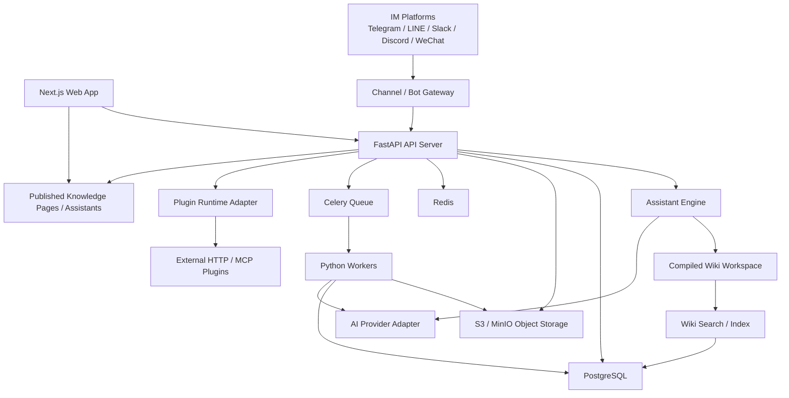

# Expert Base Architecture

## 设计目标

Expert Base 的架构目标是支撑一个私有、可生长、可扩展的专业知识库系统。系统需要能够持续接入资料、处理资料，并由 AI 持续维护一个结构化、互链、可审阅的知识工作区，让知识可以被人类阅读、被 AI 使用，并被发布为网页、API、智能助手或 IM 机器人。

架构设计优先考虑以下原则：

- 整洁：模块边界清晰，业务逻辑不散落在框架代码中。
- 易用：本地开发和自部署简单，早期不引入不必要的基础设施。
- 可扩展：支持插件、异步任务、AI Provider、IM 渠道和 SaaS 演进。
- 可审阅：AI 生成结果必须支持人工校对、来源引用和版本追踪。
- 可连接：知识内部支持双向链接，让文档、片段、实体、笔记和主题可以相互关联。
- 可累积：知识不是在每次提问时临时拼接，而是被持续编译、更新和维护。
- 私有可控：知识库默认私有，权限、发布和外部服务都由用户控制。

## 技术选型

### 语言

后端主语言选择 Python，前端选择 TypeScript。

Python 负责后端 API、AI 编排、文档处理、数据清洗、异步任务和插件调用。Expert Base 的核心复杂度集中在知识编译、AI workflow、文档处理、链接维护和数据分析，Python 在这些领域的生态最成熟。

TypeScript 负责前端 Web 应用、管理后台和公开页面。它适合构建类型安全、交互复杂、长期可维护的产品界面。

### 后端

- FastAPI：后端 API 框架。
- Pydantic：请求、响应和领域数据结构校验。
- SQLAlchemy 2.0：数据库访问。
- Alembic：数据库迁移。
- Celery：异步任务队列。
- Uvicorn：ASGI 服务运行时。

### 前端

- Next.js App Router：Web 应用框架。
- React：UI 基础。
- TypeScript：类型系统。
- Tailwind CSS：样式系统。
- shadcn/ui：基础 UI 组件。

### 数据与基础设施

- PostgreSQL：主数据库。
- pgvector：可选语义搜索能力，不作为第一阶段核心依赖。
- Redis：缓存、队列 broker、短期会话状态。
- S3-compatible object storage：文件和原始资料存储。
- MinIO：本地开发和自部署对象存储。
- Docker Compose：本地开发和早期自部署。

### AI 与知识工作区

- OpenAI / Anthropic / Local Model Adapter：模型供应商适配层。
- PostgreSQL full-text search：全文检索。
- Markdown-compatible Wiki Workspace：AI 持续维护的结构化知识层。
- Wiki Compiler Pipeline：将原始资料编译为可读、可链接、可审阅的知识页面。
- Wiki Lint Pipeline：检查矛盾、孤立页面、过期结论、缺失链接和引用问题。
- pgvector：后续用于大规模知识库的辅助搜索。

### 多语言知识处理

Expert Base 不依赖向量数据库本身解决多语言问题。pgvector 只负责向量存储和相似度计算，多语言语义对齐由 embedding 模型、Wiki 编译策略和语言元数据共同承担。

多语言处理遵循以下原则：

- 原文保留：Raw Sources 保留原始语言，不覆盖、不自动替换。
- 语言标记：Source、Document、Wiki Page 和 Citation 都记录语言信息。
- 跨语言 Wiki：同一知识主题可以拥有不同语言页面，也可以拥有一个主页面加多语言别名。
- 多语言链接：`knowledge_links` 支持连接不同语言的等价主题、翻译页面和相关概念。
- 模型选择：如果启用语义搜索，必须选择支持多语言语义对齐的 embedding 模型。
- 查询策略：用户用任意语言提问时，系统优先查找对应语言 Wiki 页面；缺失时再跨语言查找相关页面。
- 回答语言：Assistant 默认使用用户提问语言回答，但引用必须追溯到原始来源。

因此，第一阶段的多语言核心不是“用向量检索解决一切”，而是先在 Wiki 层建立清晰的语言、别名、引用和跨语言链接结构。向量搜索只作为后续大规模、多语言模糊查找的辅助能力。

## 架构形态

Expert Base 第一阶段采用模块化单体架构，而不是微服务。

知识架构参考 LLM Wiki 模式：系统不以传统 RAG 作为核心路径，而是维护三层知识结构。

- Raw Sources：用户导入的原始资料，不被 AI 修改，是事实来源。
- Compiled Wiki：AI 持续生成和维护的结构化 Markdown-compatible 知识层，包括主题页、实体页、综合页、索引页、双向链接和引用。
- Wiki Schema：约束 AI 如何维护知识库的规则文档，包括页面格式、命名约定、链接规则、引用规则、导入流程、审阅流程和 lint 流程。

用户和 AI 的主要交互对象是 Compiled Wiki，而不是每次提问时从原始文档中临时检索片段。原始资料用于溯源、校验和必要时重新编译。

服务边界如下：

- Web App：Next.js 前端。
- API Server：FastAPI 后端。
- Worker：Celery 异步任务。
- Database：PostgreSQL。
- Redis：队列和缓存。
- Object Storage：文件存储。
- External Plugins：外部插件服务。
- IM Platforms：Telegram、LINE、Slack、Discord、微信等外部渠道。

模块化单体可以保持早期开发简单，同时通过清晰模块边界为未来拆分服务预留空间。只有当某个模块出现明确的性能、部署或团队边界需求时，才考虑从单体中拆出独立服务。

## 系统架构图



## 代码组织

建议采用 monorepo：

```txt
apps/
  web/                 # Next.js 前端
  api/                 # FastAPI API 服务
  worker/              # Celery Worker

packages/
  shared-contracts/    # OpenAPI 生成的前端类型或共享协议
  plugin-sdk/          # 插件协议、类型和示例

infra/
  compose.development.yml
  compose.production.yml
  postgres/
  minio/
  redis/

docs/
  architecture/
```

后端内部按业务模块组织：

```txt
apps/api/
  app/
    modules/
      identity/          # 用户、组织、认证
      knowledge_base/    # 知识库
      sources/           # 原始资料来源
      documents/         # 文档和内容片段
      ingestion/         # 导入流程
      processing/        # 清洗、摘要、分类、实体抽取
      wiki/              # Wiki 页面、索引、双向链接、维护日志
      compiler/          # 原始资料到知识工作区的编译流程
      search/            # Wiki 搜索、索引和上下文查找
      ai/                # 模型适配、Prompt、AI 任务
      review/            # 人工校对、确认、版本
      publishing/        # 分享、公开页面、服务化
      schema/            # Wiki 规则、页面格式、维护流程
      assistants/        # 知识库机器人配置
      channels/          # IM / Bot 渠道接入
      conversations/     # 会话和消息
      plugins/           # 插件注册、调用、权限
      billing/           # 付费和订阅，后续实现
```

## 核心模块

### Identity

负责用户、组织、认证和基础权限。知识库默认私有，所有读取、检索、问答、发布和插件调用都必须经过权限判断。

### Knowledge Base

负责知识库的创建、配置、成员、权限和生命周期。一个知识库可以绑定多个资料来源、文档、AI 助手和发布渠道，并支持知识内部的双向链接。

### Sources

负责管理原始资料来源，包括用户上传文件、网页、第三方 API、云盘、MCP 或插件导入的数据。原始资料默认不可变，作为知识库的事实来源和引用根基。

### Documents

负责存储文档、抽取文本、文档片段和来源引用。所有可用于 AI 的内容都必须能追溯到原始来源。

### Ingestion

负责资料导入流程。它接收文件、URL、API 数据或插件输入，并创建处理任务。

### Processing

负责数据清洗、文本抽取、切分、摘要、分类、标签、实体识别、关系提取和链接建议。处理结果进入待审阅状态，由人工确认后成为正式知识。

### Wiki

负责 AI 维护的知识工作区，包括页面、索引、双向链接、主题页、实体页、综合页、引用和维护日志。Wiki 是原始资料之上的持久知识层，不是每次提问时临时拼接出的上下文。

### Schema

负责定义 Wiki 的维护规则，包括目录结构、页面类型、frontmatter、命名约定、双向链接规则、引用格式、导入流程、查询沉淀流程和 lint 检查标准。Schema 让 AI 成为有纪律的知识库维护者，而不是泛用聊天机器人。

### Compiler

负责将原始资料编译进入 Wiki。编译过程会创建或更新页面、补充引用、维护索引、生成双向链接建议，并标记新增资料与既有结论之间的冲突。

### Search

负责在 Wiki 层进行全文搜索、索引导航和上下文查找。第一阶段优先使用索引文件、结构化元数据和 PostgreSQL full-text search；向量搜索作为后续大规模场景的辅助能力。

### AI

负责统一模型调用、Prompt 管理、结构化输出、错误重试和成本记录。业务模块不直接调用模型供应商。

### Review

负责人工校对流程。AI 生成的摘要、标签、实体、关系和知识卡片都应支持审阅、修改、确认和版本追踪。

### Publishing

负责将知识库内容以可控方式对外提供，包括公开页面、私有分享链接、付费文本库、API 服务和智能助手。

### Assistants

负责知识库机器人的配置。一个 Assistant 可以绑定一个或多个知识库，并配置回答策略、权限策略、引用策略和可用渠道。

### Channels

负责接入不同 IM 或 Bot 平台，例如 Telegram、LINE、Slack、Discord、微信、企业微信和 Web Chat。

不同平台的协议不应该进入 Assistant Engine。Channel Gateway 负责验签、解析、格式转换、发送回复和处理平台限制。

### Conversations

负责会话、消息、上下文、外部用户映射和消息投递记录。所有渠道消息都统一进入内部会话模型。

### Plugins

负责插件注册、权限声明、调用、状态和版本管理。早期插件以外部服务为主，不允许用户上传任意代码到主系统运行。

## 核心数据模型

第一阶段建议包含以下核心表：

```txt
users
organizations
memberships
knowledge_bases
knowledge_base_members
sources
documents
document_chunks
entities
relations
notes
wiki_pages
wiki_page_versions
wiki_schema_versions
knowledge_links
source_citations
language_aliases
wiki_maintenance_logs
wiki_lint_runs
processing_jobs
review_items
assistants
assistant_knowledge_bases
channel_connections
channel_users
conversations
messages
message_delivery_attempts
plugin_installations
access_policies
published_assets
```

其中最重要的关系是：

- 一个 `knowledge_base` 拥有多个 `sources`、`documents`、`entities`、`notes`。
- 一个 `document` 来源于一个 `source`，必要时可被切分为多个 `document_chunks`，用于长文处理和来源引用定位。
- 一个 `wiki_page` 是 AI 编译和维护后的知识页面，可以是主题页、实体页、综合页、索引页或分析页。
- 一个 `wiki_page_version` 记录页面的历史版本，用于追踪知识如何随资料增加而变化。
- 一个 `wiki_schema_version` 记录 Wiki 维护规则的版本，让页面结构、引用格式和导入流程可以演进。
- 一个 `knowledge_link` 表示两个知识对象之间的双向链接，可以连接文档、片段、实体、笔记或主题。
- 一个 `source_citation` 将 Wiki 页面中的关键结论追溯到原始资料或文档片段。
- 一个 `language_alias` 记录不同语言下的主题名称、别名、翻译关系和规范名称。
- 一个 `wiki_maintenance_log` 记录导入、查询、页面更新、链接更新和 lint 操作。
- 一个 `wiki_lint_run` 记录周期性健康检查结果，例如矛盾、孤立页面、缺失引用和过期结论。
- 一个 `assistant` 可以绑定多个 `knowledge_bases`。
- 一个 `channel_connection` 将 assistant 发布到某个 IM 平台。
- 一个 `conversation` 记录外部用户和 assistant 之间的会话。
- 一个 `access_policy` 决定知识、检索、发布和外部调用的权限。

## 知识处理流程

```txt
导入资料
  -> 创建 Source
  -> 存储原始文件或原始内容
  -> 创建 Document
  -> 抽取文本
  -> 清洗文本
  -> 分析资料中的关键事实、实体、主题和关系
  -> 查找既有 Wiki 页面
  -> 创建或更新 Wiki 页面
  -> 更新索引和维护日志
  -> 补充来源引用
  -> 生成双向链接建议
  -> 标记与既有结论的冲突或不一致
  -> 创建 Review Item
  -> 人工审阅和修正
  -> 确认为正式知识
  -> 进入检索、问答、发布和机器人服务
```

AI 输出不能默认成为最终知识。系统必须区分“AI 建议”和“人工确认后的知识”。

## 问答和 Wiki 使用流程

```txt
用户提问
  -> 权限检查
  -> 识别查询语言和主题别名
  -> 读取 Wiki 索引
  -> 优先查找同语言 Wiki 页面
  -> 必要时通过跨语言别名和链接查找相关页面
  -> 阅读页面、链接页面和必要的原始引用
  -> 调用 AI Provider
  -> 生成回答
  -> 附带来源引用
  -> 判断回答是否应沉淀为新的 Wiki 页面或更新既有页面
  -> 记录问题、回答、引用、页面更新和成本
```

默认原则是优先基于已经编译好的 Wiki 层回答，而不是每次从原始资料中重新拼接上下文。回答中引用的内容必须能追溯到 `wiki_pages`、`source_citations` 和 `sources`。当一次问答产生了新的分析、比较或综合结论时，它应该可以被沉淀回 Wiki，让后续使用继续累积。

## IM Bot 接入流程

```txt
用户在 IM 平台发送消息
  -> 平台调用 Webhook
  -> Channel Gateway 验签
  -> 转换为统一 IncomingMessage
  -> 匹配 Channel Connection
  -> 找到 Assistant
  -> 映射外部用户
  -> 创建或恢复 Conversation
  -> 权限检查
  -> 调用 Assistant Engine
  -> 查找相关 Wiki 页面和来源引用
  -> AI 生成回答
  -> 记录消息和引用
  -> 调用平台 API 回复用户
```

统一内部消息结构：

```txt
IncomingMessage
  channel
  external_user_id
  external_conversation_id
  message_type
  text
  attachments
  timestamp
```

第一阶段建议优先支持 Web Chat 和 Telegram。LINE、Slack、Discord、微信和企业微信可以在 Channel Gateway 稳定后逐步增加。

## 插件架构

插件采用外部化设计：

```txt
插件 = manifest + 外部服务 + 标准输入输出协议
```

插件不在主系统内运行任意代码。主系统通过 HTTP、Webhook 或 MCP 调用外部插件，并根据插件声明的权限控制其访问范围。

插件类型：

```txt
ingestion     # 数据接入
processor     # 数据处理
renderer      # 展示和发布
assistant     # AI / Bot / MCP 能力
storage       # 存储适配，早期谨慎开放
```

插件 manifest 示例：

```json
{
  "name": "web-fetcher",
  "type": "ingestion",
  "version": "0.1.0",
  "endpoint": "https://plugin.example.com/ingest",
  "permissions": ["network:read", "document:write"],
  "input_schema": {},
  "output_schema": {}
}
```

第一阶段建议先实现内置导入和处理能力，再开放外部插件协议。过早做完整插件市场会增加安全、版本和兼容性成本。

## 权限与隐私

Expert Base 默认私有。权限设计必须覆盖以下场景：

- 用户和组织成员访问。
- 知识库级权限。
- 文档级权限。
- 公开元数据和私有正文的区分。
- 发布页面权限。
- Assistant 查询权限。
- IM 外部用户权限。
- 插件访问权限。
- API token 权限。

权限判断不能只发生在 UI 层。API、检索、AI 上下文组装、发布、插件调用和 Bot 回复都必须执行权限检查。

## 部署策略

### 本地开发

使用 Docker Compose 启动：

```txt
PostgreSQL
Redis
MinIO
API Server
Worker
Web App
```

本地开发应尽量做到一条命令启动完整环境。

### 自部署版本

自部署版本继续使用 Docker Compose 作为第一选择。它适合个人、工作室和小组织部署私有知识库。

### SaaS 版本

SaaS 版本可以在后续演进到：

- API / Worker 独立扩容。
- 对象存储使用 S3、R2 或 OSS。
- 数据库使用托管 PostgreSQL。
- Redis 使用托管服务。
- 按组织隔离数据和账单。

第一阶段不需要 Kubernetes。只有当部署规模、租户隔离或弹性扩容成为明确需求时，再考虑更复杂的基础设施。

## 第一阶段建议范围

第一阶段应该优先实现最小闭环：

- 用户和知识库。
- 文件和 URL 导入。
- 文本抽取。
- Wiki 页面生成和更新。
- Wiki 索引、维护日志和双向链接。
- 来源引用追踪。
- AI 摘要、标签、链接建议和问答。
- 人工审阅和确认。
- Web 管理后台。
- Web Chat 或 Telegram Bot。
- 基础权限。

第一阶段暂不实现：

- 完整插件市场。
- 多存储后端自由切换。
- 视频和音频处理。
- 复杂计费系统。
- 多渠道 IM 全量支持。
- 企业级审计和合规。
- 微服务拆分。

## 最终敲定架构

Expert Base 采用以下架构作为初始基线：

```txt
语言：
- Python：后端、AI、数据处理、Worker
- TypeScript：前端

后端：
- FastAPI
- Pydantic
- SQLAlchemy 2.0
- Alembic
- Celery

前端：
- Next.js App Router
- React
- TypeScript
- Tailwind CSS
- shadcn/ui

数据：
- PostgreSQL
- Redis
- S3-compatible object storage
- MinIO for local development

架构：
- Monorepo
- Modular Monolith
- Background Workers
- Human-in-the-loop Wiki Compiler
- External Plugin Protocol
- Channel / Bot Gateway
- API-first
```

这套架构优先保证项目整洁、易用和可扩展。它可以支撑早期个人开发和自部署，也为后续 SaaS、插件生态、知识库机器人和商业化服务预留演进空间。

## 参考模式

- [LLM Wiki by Andrej Karpathy](https://gist.github.com/karpathy/442a6bf555914893e9891c11519de94f)：Expert Base 的知识层参考其 Raw Sources、Compiled Wiki、Schema 三层思想。项目不以传统 RAG 作为核心路径，而是让 AI 持续维护一个可累积、可互链、可审阅的知识工作区。
